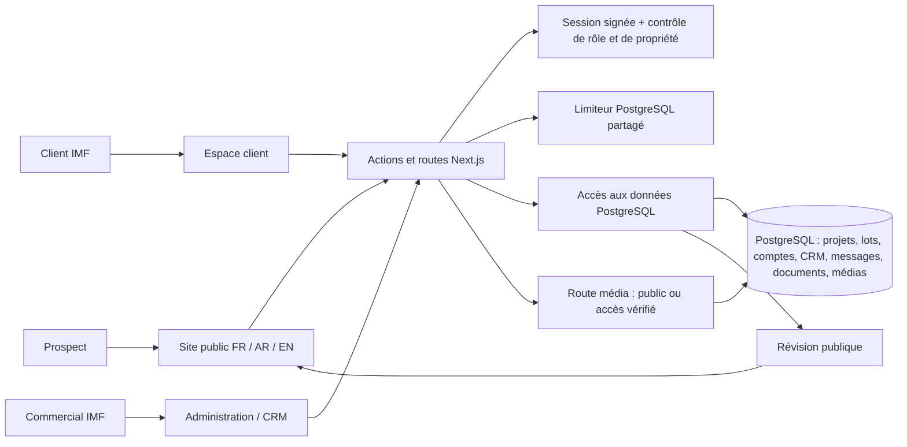

# Architecture IMF — état vérifié le 24 septembre 2026

Ce document décrit le code actuel. Il ne constitue pas une certification de capacité ou de sécurité en production. `docs/architecture-audit.md` décrit l'état antérieur du 18 septembre ; les points déjà migrés vers PostgreSQL sont actualisés ici.

## Frontières et flux

- Le site public lit uniquement les projets, lots, paramètres de société et actualités avec `readPublic()`. Les comptes, messages et contrats ne sont pas inclus dans cette lecture. Les prix et disponibilités sont lus à l'exécution, non figés lors de la compilation.
- Le formulaire public valide la demande côté serveur, limite les envois, puis crée contact, opportunité, activité et tâche dans le CRM. Une visite demande un lot encore disponible ; le rendez-vous reste à confirmer par le commercial.
- Les pages privées exigent une session signée. Chaque requête relit l'identité et le rôle depuis une requête SQL ciblée ; l'espace client lit ensuite seulement son dossier, ses messages et ses documents dans un instantané cohérent. Les droits sur les documents sont contrôlés avant la lecture des octets. La réinitialisation d'un mot de passe invalide les anciennes sessions avec `authVersion`.
- Les actions commerciales exigent le rôle `admin` et un stockage durable. Les écritures PostgreSQL sont transactionnelles, vérifient la révision précédente et refusent un écrasement silencieux. Les fichiers et leurs métadonnées sont enregistrés dans la même transaction.
- La route des médias ne charge que les métadonnées pour une galerie publique. Un média privé déclenche en plus la vérification du compte, de l'attribution et du document ou des photos de chantier autorisés. Les contrats et les pages authentifiées ne sont pas conservés dans le cache PWA.
- Chaque écriture incrémente une révision PostgreSQL. Le site public compare cette révision entre instances et rafraîchit les onglets déjà ouverts ; la lecture publique vérifie aussi la révision avant d'utiliser son cache.
- Les tentatives de connexion et les envois partagent maintenant des compteurs PostgreSQL atomiques entre les instances. Sans base, le développement local utilise un compteur en mémoire. Si PostgreSQL est indisponible en production, ces actions sont refusées.

## Déploiement et limites vérifiables

Vercel exécute Next.js et la base PostgreSQL est sélectionnée par `DATABASE_URL`. `AUTH_SECRET` est requis sur Vercel. Le schéma est créé à l'exécution et versionné par `database/001-initial.sql`, `002-runtime.sql` et `003-rate-limits.sql` pour les migrations explicites. `npm run db:migrate` applique ces fichiers. Une erreur PostgreSQL ne provoque pas un retour silencieux vers le jeu de démonstration.

Le stockage des contrats et photos ajoutés par l'administration est encore dans PostgreSQL (`bytea`). Les contrats et photos de chantier sont limités à 3 Mo à l'envoi ; les photos de galerie et panoramas acceptent 8 Mo avant conversion WebP et 3 Mo après conversion. Cela évite un disque éphémère, mais ne convient pas à une photothèque importante. La prochaine étape est un stockage objet privé pour les contrats, public/CDN pour les galeries, avec migration et contrôle d'accès. Le moteur CRM recharge encore ses collections pour certaines opérations : pagination, lectures ciblées et essais de charge seront nécessaires avant une forte croissance. Les sauvegardes/restaurations, la supervision, les accès de démonstration et les parcours sur la configuration réelle de production doivent être vérifiés avant de qualifier l'ensemble de prêt pour une grande échelle.

## Vérifications locales

`npm test` inclut une base PGlite isolée pour la cohérence des écritures, l'invalidation publique, les médias, les recherches d'identité et les compteurs de plusieurs instances. `npm run typecheck` et `npm run build` vérifient le code. Ces tests ne remplacent ni une mesure de charge, ni une restauration de sauvegarde, ni une recette sur Vercel/Neon.
